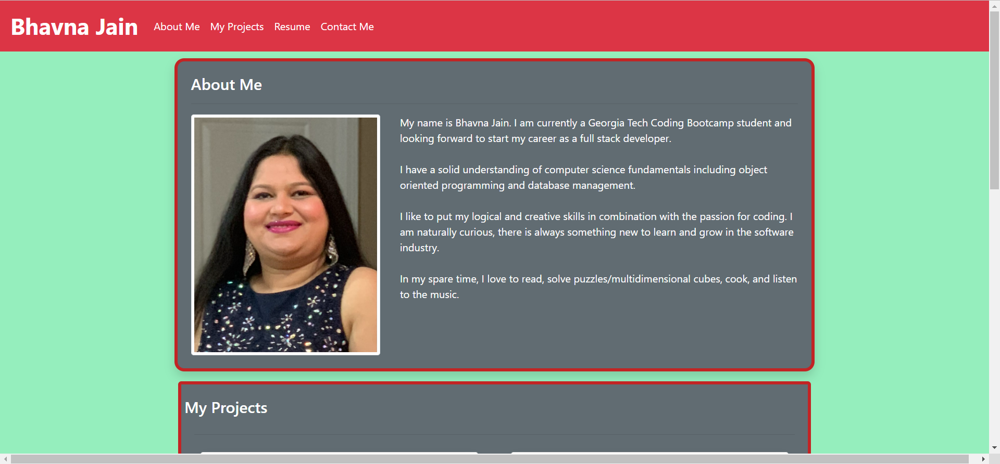
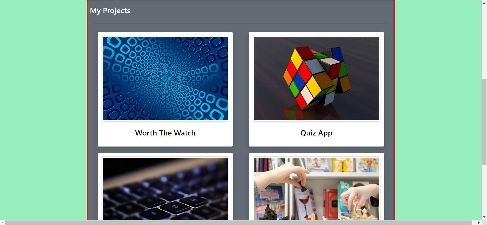

# Portfolio

## Description
 
This project was to create a portfolio webpage to put evrything which you want to showcase to your future employers. It includes your profile picture, links to your best projects in varied technologies, your resume, and your contact details via different mediums.

## Expected Goal

* It should be a simple and attractive page with good navigation, and the flow of page should be smooth. It should not be crowded with too much stuff but only to the point things.

* The projects should navigate to another live deployed application to exhibit your technical skilset.

* You should use the multiple features of CSS to make your page responsive to different media screen sizes, HTML tags should be semantic and should have accesibility.

## Screenshots

##  Link to the deployed application

[Portfolio](https://bhavnao.github.io/Portfolio/)

